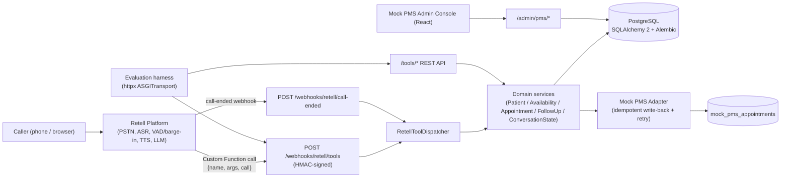
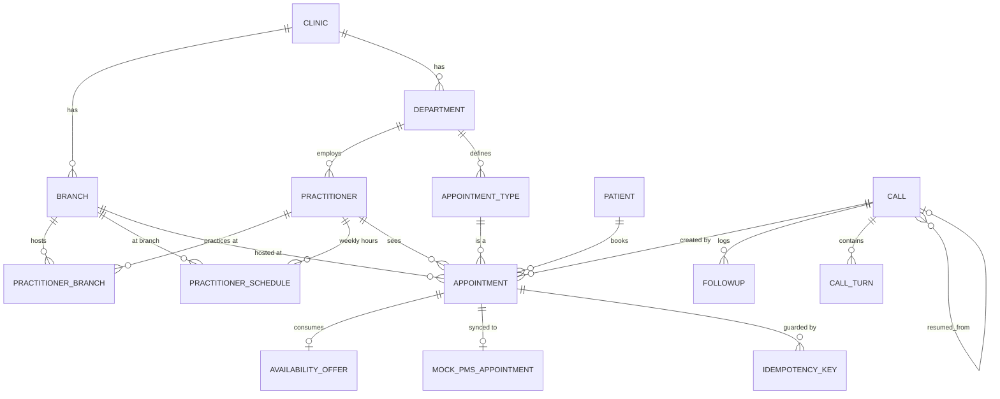

# Care AI (Sunrise Multispecialty Clinic Voice Receptionist)

This is a self-contained brief for the 2care.ai technical interview with Bala. It
explains **what was built, why, how (HLD + LLD)**, maps every assignment
requirement to the actual code, and gives model answers to the questions you're
most likely to be asked — plus a section on how to improve the AI response
quality further. Code references point at real files in this repo so you can
pull any of them up live if asked to "show me."

---

## Before you start — beginner-friendly way to use this document

Do **not** try to memorise every technical word or every file name. The
technical detail below is evidence for follow-up questions. First understand
and practise the simple story:

> I built Maya, a voice receptionist for a two-branch clinic. A caller speaks
> to Maya in English, Hindi, or Hinglish. Maya uses Retell for listening and
> speaking, then calls my FastAPI backend to look up a patient, check live
> appointment slots, and book, reschedule, or cancel safely. PostgreSQL is the
> final source of truth, so the AI cannot create duplicate bookings or book an
> old slot from memory. I also save important call state in the database, so a
> caller can continue after a disconnected call.

### A simple analogy

Think of Maya as a receptionist at a clinic:

| In the real clinic | In this project |
|---|---|
| Receptionist who talks to patients | Retell + LLM |
| Appointment register | PostgreSQL database |
| Checking the doctor's live calendar | `search_availability` backend tool |
| Writing a confirmed appointment in the register | `create_appointment` backend tool |
| Hospital/PMS system | Mock PMS write-back |
| Notes left after a dropped call | Durable `calls` table |

The important rule is: **Maya can talk, but the database decides facts.**
The LLM is not allowed to invent slots, patient IDs, fees, or booking
confirmations.

### HLD and LLD in simple words

- **HLD (High-Level Design):** the big-picture map. It answers: “What are the
  main parts of the system, and how do they communicate?” Example: Caller →
  Retell → FastAPI → PostgreSQL.
- **LLD (Low-Level Design):** the inside details. It answers: “How exactly do
  we prevent a duplicate booking?” Example: transaction, live slot re-check,
  database constraint, and idempotency record.

### A safe interview answer pattern

For most technical questions, answer in this order:

1. **Problem:** “The risk is that two callers may try to book the same slot.”
2. **Solution:** “I check it in the backend and enforce it in PostgreSQL.”
3. **Why:** “The database still protects us if two requests arrive at the
   same time.”
4. **Evidence:** “This is implemented in `appointment_service.py` and the
   `Appointment` model.”

You do not need to begin with jargon. Say the simple explanation first; use
technical words only if the interviewer asks for deeper detail.

### Short glossary

| Term | Simple meaning |
|---|---|
| **LLM** | The AI “brain” that understands speech text and decides what to say or which tool to call. |
| **Retell** | The voice platform. It handles phone/browser calling, speech-to-text, text-to-speech, and interruption handling. |
| **FastAPI backend** | Our Python server. It performs the real business actions safely. |
| **PostgreSQL** | The permanent database where patients, appointments, and call state are stored. |
| **Tool / Custom Function** | A safe API action the LLM can request, such as “search slots” or “create appointment.” |
| **Webhook** | An HTTP endpoint that Retell calls to send a tool request to our backend. |
| **Transaction** | A group of database operations treated as one safe unit: either all save, or none save. |
| **Constraint** | A rule enforced by the database itself, such as “two booked appointments cannot overlap.” |
| **Idempotency** | Sending the same request twice gives the original result instead of creating a duplicate booking. |
| **Live availability** | Availability calculated from the current schedules and current bookings, not from old conversation memory. |
| **Durable state** | Important information saved permanently in the database, so it survives a call drop or server restart. |
| **PMS/EHR** | The clinic’s appointment/patient-management system. This project uses a mock version to demonstrate write-back. |
| **ASR** | Automatic Speech Recognition: turning the caller’s voice into text. |
| **TTS** | Text-to-Speech: turning Maya’s response text into spoken audio. |
| **VAD / barge-in** | Voice Activity Detection / interruption handling: Maya stops speaking when the caller starts speaking. |
| **RAG / Knowledge Base** | A way for the LLM to retrieve relevant clinic FAQ/policy documents before answering. It is useful for information, but not for live booking facts. |

### 60-second project explanation

> I built a multilingual voice receptionist called Maya for a clinic with two
> branches. Retell manages the voice experience: it listens to English, Hindi,
> or Hinglish and speaks back naturally. For important actions, the LLM calls
> my FastAPI tools rather than guessing. The backend checks the patient,
> searches live availability from PostgreSQL, and safely creates, reschedules,
> or cancels appointments. PostgreSQL prevents overlapping bookings even if
> two callers book simultaneously. I added idempotency so a repeated tool call
> does not make a duplicate appointment, and durable call state so Maya can
> continue after a dropped call. Finally, I added a mock PMS sync with retry
> and an evaluation harness that tests real backend scenarios.

---

## 1. The assignment, in one paragraph

Build a voice AI receptionist for a real two-branch clinic that books,
reschedules, and cancels appointments end-to-end, no human involved, in
**English, Hindi, and mid-call Hinglish**, on **one** platform (Retell, Bolna,
Vapi, or LiveKit), backed by a **real database** with **write-time
conflict/double-booking protection**, a **mock PMS write-back** with
idempotency, and a **re-runnable evaluation harness** with per-language
metrics and latency breakdown. It must be **live and independently callable**
— "if we can't call the agent ourselves and have it work, it doesn't count."

Full original brief: [`ASSIGNMENT.md`](../ASSIGNMENT.md) (gitignored locally,
not part of the repo submission).

---

## 2. What we built — elevator pitch

> **Maya** is a Retell-hosted voice agent for **Sunrise Multispecialty
> Clinic** (Koramangala + Indiranagar, Bengaluru). Retell handles telephony,
> ASR, VAD/barge-in, and TTS. Retell's LLM calls **8 Custom Functions** that
> all hit one signed webhook (`POST /webhooks/retell/tools`) on a FastAPI
> backend. The backend is the source of truth for everything that must never
> be wrong: patient identity, live availability, conflict prevention,
> idempotent writes, and durable per-call state (so a dropped call can
> resume). PostgreSQL enforces double-booking prevention with a real
> `EXCLUDE` constraint, not just application logic. A mock PMS adapter
> receives a write-back after every confirmed booking, with retry/backoff and
> a visible sync-status. An evaluation harness runs ~18 multi-step scenarios
> against the real ASGI app + real Postgres and reports per-language,
> per-tool, and per-booking-operation metrics.

Live pointers (see root [`README.md`](../README.md) for current links):
Retell agent, backend Swagger, mock-PMS admin console, GitHub repo, system
prompt, dashboard config, manual test script.

---

## 3. High-Level Design (HLD)

### 3.1 System context



**Key point for the interview:** the backend has **two entry surfaces** into
the *same* services — a thin Retell/Bolna adapter layer, and a stable
`/tools/*` REST API. Retell never talks to `/tools` directly; the adapter
translates `{name, args, call}` into the same Pydantic request objects the
REST layer uses. This is what makes the platform swappable (Bolna adapter
exists too, unused live) and testable without a phone call.

### 3.2 Component responsibilities

| Layer | Component | Responsibility |
|---|---|---|
| Voice platform | Retell | Telephony, multilingual ASR/TTS, VAD/barge-in, LLM orchestration, holding phrases |
| Adapter | `app/adapters/retell/*` | Signature verification, payload parsing, tool→service translation, error recovery hints |
| Domain services | `app/services/*` | Business rules: patient identity, live availability, booking/reschedule/cancel transactions, conversation memory, PMS sync, follow-ups |
| Repositories | `app/repositories/*` | SQLAlchemy query encapsulation per aggregate (patients, scheduling, appointments, calls, offers, PMS, followups, metrics) |
| Persistence | PostgreSQL | Source of truth; DB-level exclusion constraints for conflicts; durable `calls` rows for resume state |
| Mock PMS | `app/pms/mock.py` | Simulates a real EHR/PMS write-back with its own idempotency and failure surface |
| Observability | `app/core/{metrics,observability,logging}.py` | structlog JSON logs, Prometheus counters/histograms, a `metric_events` table for ad-hoc SQL analysis |
| Eval harness | `backend/evaluation/*` | Scripted multi-turn scenarios over the real app + dedicated DB, JSON + console report |
| Admin UI | `frontend/` (React/Vite) | Read-only visibility into mock PMS appointments/receipts + manual retry |

### 3.3 Primary flow — voice booking

```mermaid
sequenceDiagram
    participant C as Caller
    participant R as Retell (ASR/LLM/TTS)
    participant W as /webhooks/retell/tools
    participant D as RetellToolDispatcher
    participant S as Services
    participant DB as PostgreSQL

    C->>R: "I need a dermatology appt next Tuesday afternoon"
    R->>W: name=lookup_patient, args={phone, full_name}
    W->>D: verify HMAC signature, parse payload
    D->>S: PatientService.lookup_by_phone/name
    S->>DB: SELECT patients WHERE phone=...
    DB-->>S: 0/1/many rows
    S-->>D: PatientLookupResponse
    D-->>R: {ok, result: {patients, requires_disambiguation}}
    R->>C: asks name if ambiguous, else proceeds
    R->>W: name=search_availability, args={dept, branch?, date/time hints}
    W->>D: dispatch → AvailabilityService.search
    D->>DB: load schedules + booked appointments for the window
    DB-->>D: live slots
    D-->>R: slots incl. start_time_display (pre-computed local string)
    R->>C: speaks ONE slot naturally, asks for confirmation
    C->>R: "Yes"
    R->>W: name=create_appointment, args={patient_id, slot fields, caller_full_name}
    W->>D: dispatch (Idempotency-Key derived from call_id+tool+args hash)
    D->>S: AppointmentService.create()
    S->>DB: BEGIN; advisory lock on practitioner_id; re-check live availability; INSERT (EXCLUDE constraint enforced); COMMIT
    S->>S: post-commit PMS write-back (best effort, never blocks confirmation)
    S-->>D: AppointmentConfirmation
    D-->>R: {ok, result}
    R->>C: "Done — you're booked with Dr. Rao, Tuesday at 4:30 PM."
```

### 3.4 Dropped-call / callback resume flow

```mermaid
sequenceDiagram
    participant C as Caller
    participant R as Retell
    participant CE as /webhooks/retell/call-ended
    participant CT as /webhooks/retell/tools
    participant SS as ConversationStateService
    participant DB as PostgreSQL (calls table)

    Note over C,R: Call drops mid-booking
    R->>CE: call_status=disconnected, call_id=A
    CE->>SS: complete(call_id=A, disconnected=True)
    SS->>DB: mark_disconnected(A); write conversation_summary
    Note over C,R: Caller calls back minutes later
    R->>CT: any tool call, call={call_id=B, from_number=same, resumed_from_call_id?=A}
    CT->>SS: restore_or_create(context)
    SS->>DB: find explicit parent A, or latest resumable call for this phone
    DB-->>SS: source call A (patient_id, selected branch/doctor/type, pending_confirmation, last_availability_search)
    SS->>DB: create call B with resumed_from_call_id=A, copy resumable fields
    SS-->>CT: call B (already carrying prior context)
    CT-->>R: tool result as usual
    R->>C: "You were disconnected — we were looking at Tuesday afternoon, continue?"
```

---

## 4. Low-Level Design (LLD)

### 4.1 Data model (core tables)



Full model files: `backend/app/db/models/*.py`. Migrations:
`backend/alembic/versions/*.py`.

### 4.2 The four mechanisms that make the "required scenarios" actually hold

These are the pieces most worth walking through live in the interview,
because they're deterministic backend guarantees, not prompt promises.

**a) Double-booking prevention — DB-enforced, not app-enforced**

```20:135:backend/app/db/models/appointment.py
    __table_args__ = (
        ExcludeConstraint(
            ("practitioner_id", "="),
            (text("tstzrange(start_time, end_time, '[)')"), "&&"),
            name="uq_appointment_no_overlap",
            using="gist",
            where=text("status = 'booked'"),
        ),
        ExcludeConstraint(
            ("patient_id", "="),
            (text("tstzrange(start_time, end_time, '[)')"), "&&"),
            name="uq_appointment_patient_no_overlap",
            using="gist",
            where=text("status = 'booked'"),
        ),
        ...
```

- Two `EXCLUDE ... USING gist` constraints (needs the `btree_gist` extension):
  one keyed on `practitioner_id` (no double-booking a doctor), one on
  `patient_id` (no double-booking the same patient across doctors/branches).
- Scoped to `status = 'booked'` via a partial index predicate so cancelled/
  completed rows don't block new bookings.
- This holds under **real concurrency**: two simultaneous `INSERT`s for the
  overlapping range will have the database reject the second one — an
  application-level "SELECT then INSERT" check alone cannot guarantee this
  under a race.
- **Belt-and-suspenders, not belt-only:** before that INSERT is even
  attempted, `AppointmentService.create()` also takes a Postgres advisory
  transaction lock per practitioner (`pg_advisory_xact_lock(hashtext(...))`)
  and re-runs a live availability check. The advisory lock exists because
  buffer-time logic (gaps between appointments) isn't expressible purely as
  a range-overlap exclusion constraint — it needs an app-level recheck, and
  the lock serializes that recheck per practitioner. The DB constraint is
  the final, unconditional guarantee; the lock+recheck is what makes the
  *buffer-time* rule hold under concurrency too. Verified by the harness's
  `double_booking` scenario, which fires two concurrent `create_appointment`
  calls for the identical slot and asserts exactly one 201 and one 409.

**b) "Never book from stale availability" — the offer/TTL mechanism**

- `AvailabilityService.search()` never reads from a cache; every search
  re-queries `practitioner_schedules` + live `appointments` for the
  requested window (`backend/app/services/availability_service.py`).
- Every returned slot is persisted as a short-lived `AvailabilityOffer` row
  (`AVAILABILITY_OFFER_TTL = 3 minutes`, `app/core/guardrails.py`).
- `create_appointment` / `reschedule_appointment` **require** an active,
  unconsumed offer matching practitioner+branch+type+start_time
  (`_require_active_offer` in `appointment_service.py`). No offer → the tool
  fails with `availability_search_required`, which the dispatcher rewrites
  into an explicit instruction back to the LLM: *"do NOT retry with the same
  args; search again."* This is what stops the LLM from confirming a booking
  purely from its own conversational memory of an earlier tool result.
- On top of the offer check, the service does one more **live re-check**
  (`AvailabilityService.is_slot_currently_available`) inside the same
  transaction, immediately before insert — so even a slot taken in the few
  seconds between search and confirm is caught.

**c) Idempotent writes — safe retries on a flaky call/tool layer**

- Every mutating tool call carries an `Idempotency-Key`. For Retell, the
  dispatcher derives it deterministically:
  `f"retell:{call_id}:{tool_name}:{sha256(sorted(args))[:24]}"`
  (`RetellToolDispatcher._idempotency_key`).
- `AppointmentService` stores `(key, operation_type, request_hash,
  response_snapshot)` in an `idempotency_keys` table inside the **same**
  transaction as the write. A replayed key with the *same* request hash
  returns the original response with `idempotent_replay: true` — no new
  side effect. A replayed key with a *different* payload is rejected with
  409 (`"Idempotency-Key was already used for a different request."`).
- This matters specifically for voice: LLM function-calling occasionally
  double-fires a tool call, or a webhook retry happens after a timeout on
  Retell's side. Idempotency means that never becomes a duplicate booking.

**d) Durable conversation state — Postgres, not LLM memory or Redis**

- `Call` rows (`backend/app/db/models/call.py`) hold: `language`,
  `current_intent`, `identified_patient_id`, `selected_branch_id`,
  `selected_practitioner_id`, `selected_appointment_type_id`,
  `last_availability_search` (JSONB), `pending_confirmation` (JSONB),
  `conversation_summary`, `last_tool_called`.
- `ConversationStateService.restore_or_create()` resolves a new Retell
  `call_id` to either a brand-new `Call` row, or — if Retell passes
  `resumed_from_call_id`, or (fallback) the same `from_number` has a call
  still `in_progress`/`disconnected` — a **cloned continuation** of the
  prior call's resumable fields (`_copy_resumable_state`). Completed calls
  are never reopened.
- Every tool invocation updates this row (`record_tool_result`), so state
  survives process restarts/deploys, unlike an in-memory session dict.
- `POST /webhooks/retell/call-ended` marks the call `completed` or
  `disconnected` and writes a human-readable `conversation_summary`
  (used both by the resume flow and observability).

### 4.3 Tool dispatch — request lifecycle

`RetellToolDispatcher.dispatch()` (`backend/app/adapters/retell/dispatcher.py`)
does, per call:

1. Verify HMAC signature over `raw_body + timestamp` (`X-Retell-Signature`,
   5-minute skew tolerance) — `app/adapters/retell/security.py`.
2. Parse into `RetellToolInvocation{name, args, call}` (Pydantic,
   `extra="allow"` so Retell can add fields without breaking parsing).
3. `restore_or_create` conversation state; bind structured logging/tracing
   context (provider, call_id, conversation_id, patient_id, appointment_id,
   language, conversation_state snapshot) — every log line is fully
   correlatable to one call.
4. Guard: if the call is already `COMPLETED`, refuse any further mutating
   tool call (protects against a stray retry after end-of-call).
5. Route to one of 8 handlers by `name` (`lookup_patient`,
   `get_clinic_catalog`, `list_appointments`, `search_availability`,
   `create_appointment`, `reschedule_appointment`, `cancel_appointment`,
   `create_followup`).
6. Each handler resolves human-friendly args (`branch_name`,
   `practitioner_name`, `appointment_type_name`) to real UUIDs via
   case-insensitive `ILIKE` lookups when the LLM didn't already have the
   UUID from a prior tool call, and raises a descriptive `ValidationError`
   with zero/ambiguous matches.
7. On success: persist state, log `*_tool_completed`, record Prometheus +
   DB latency metrics, return `{"ok": true, "tool": name, "result": {...}}`.
8. On a domain error (`ValidationError`/`NotFoundError`/`ConflictError`):
   return HTTP 200 with `{"ok": false, "error": {"code", "detail"}}` — **not**
   an HTTP error — because Retell needs a normal tool-result payload to feed
   back into the LLM so it can recover conversationally instead of the call
   silently breaking. `_recovery_detail`/`_recovery_error_code` rewrite
   certain errors into explicit next-step instructions for the model (e.g.
   "do NOT retry the booking; call `search_availability` again first").
9. Unexpected exceptions are logged and re-raised (surface as HTTP 500 —
   deliberately, since these represent bugs, not caller-recoverable states).

### 4.4 Live availability search algorithm

`AvailabilityService.search()` (`backend/app/services/availability_service.py`):

1. Resolve and validate `appointment_type_id`, optional `branch_id` /
   `practitioner_id` / `department_id`; reject `start_time >= end_time`.
2. Resolve "today" in the **branch's own timezone** (`Asia/Kolkata` for this
   clinic) when a branch is known — this is the specific fix for the
   "UTC/timezone bug that shifts today to tomorrow" failure mode called out
   in the assignment's test cases.
3. If no `appointment_date` given (e.g. "earliest available"), build a
   **30-day rolling window** of candidate dates from today, so a fully
   booked or after-hours "today" search doesn't falsely report zero
   availability — it naturally rolls to the next open day.
4. Load matching `PractitionerSchedule` rows and all booked `Appointment`s
   for the whole window **in one query each** (not per-day), so an
   earliest-slot search that has to look several days ahead stays O(1)
   round-trips regardless of how many days it scans.
5. Per candidate day, per matching schedule: walk forward in 5-minute
   increments from `max(schedule_start, caller's lower bound, "now" in that
   branch's zone)` up to `schedule_end - duration - buffer`, skipping any
   candidate whose `[start-buffer, end+buffer)` window intersects an
   existing booked appointment for that practitioner (buffer respected in
   application code, since a fixed buffer-aware exclusion isn't expressible
   as a plain range overlap).
6. Stop at the first day with any slots (or return all evaluated days' slots
   if none found within the horizon); sort by `(start_time, branch, doctor)`;
   truncate to 1 (`earliest_only`) or `limit`.
7. Every slot carries a pre-formatted `start_time_display` string computed
   in the **branch-local timezone before UTC conversion** (e.g. "Sat, 18
   Jul, 9:00 AM") — specifically so the LLM never has to do its own
   UTC→local/AM-PM arithmetic, which the prompt explicitly forbids because
   LLMs get it wrong.

### 4.5 PMS write-back (mock EHR)

`PmsSyncService.sync_appointment()` (`backend/app/services/pms_sync_service.py`):

- Runs **after** the booking transaction commits, in its own DB session
  (`session_scope()`), so a slow/unavailable PMS can never roll back or
  delay the caller-facing booking confirmation.
- Idempotent: keyed as `pms:{appointment_id}:{operation}`; a repeat sync for
  an already-`SYNCED` row with the same operation is a no-op.
- On failure: exponential backoff (`pms_retry_base_seconds * 2^(attempts-1)`)
  up to `pms_retry_max_attempts`, after which status becomes `FAILED` and
  is surfaced in the mock-PMS admin console for manual retry
  (`scripts/retry_pms_syncs.py`, `/admin/pms/appointments/{id}/retry`).
- `Appointment.pms_sync_status` (`pending` / `synced` / `pending_retry` /
  `failed`) is visible independently of booking `status` — the assignment
  explicitly asks for "a defined behavior when that call fails," and the
  defined behavior here is: **the booking is never blocked or reverted by a
  PMS failure; the sync retries and is independently observable/retriable.**

### 4.6 Security

- Every Retell webhook (`/webhooks/retell/tools`, `/webhooks/retell/call-ended`)
  verifies `X-Retell-Signature: v=<ts>,d=<hex>` = HMAC-SHA256(api_key,
  raw_body + timestamp), constant-time compared, with a 5-minute replay
  window (`app/adapters/retell/security.py`). In production, missing
  `RETELL_API_KEY` hard-fails startup-time config rather than silently
  skipping verification.
- CORS is allow-listed per environment (`CORS_ORIGINS`), not `*`.
- No caller data ever gets echoed into logs unmasked beyond what's needed for
  correlation (phone numbers are used for lookups but structured logs key on
  `call_id`/`patient_id`, not raw PII fields, in the adapter's bound context).

---

## 5. Key design decisions (be ready to defend all of these)

| Decision | Alternative considered | Why this choice |
|---|---|---|
| **Retell** as the only live platform | Bolna / Vapi / LiveKit | Managed PSTN + built-in VAD/barge-in + multilingual ASR/TTS out of the box let the assignment's 3-day window go into scheduling correctness instead of telephony plumbing. Bolna offers more low-level control but costs integration time this assignment didn't budget for. A Bolna adapter is kept (`docs/bolna/`) over the *same* `/tools` services to prove the backend isn't locked to one vendor, but it is not the live/graded surface. |
| **PostgreSQL `EXCLUDE` constraint** for conflicts | App-level "check-then-insert" | Only a DB constraint is safe under true concurrency. App checks alone have a race window between the read and the write. |
| **Postgres rows for call state**, not Redis/in-memory | Redis session cache | Survives process restarts/deploys without another moving piece; the assignment specifically tests state surviving a dropped call and reconnect, which needs to be durable, not just fast. Trade-off: slightly higher per-tool-call latency than Redis; acceptable because it's a handful of small indexed row reads/writes, not the bottleneck (ASR/LLM/TTS dominate spoken latency). |
| **No availability cache** at all | Cache with short TTL + invalidation | The assignment explicitly calls out "stale availability from memory" as a named failure mode. Removing the cache removes the whole bug class instead of managing invalidation correctness. The `AvailabilityOffer` row is *not* a cache — it's a receipt proving a specific live search happened, with its own expiry, purely to gate booking. |
| **Idempotency at the tool layer**, keyed off `call_id + tool + args hash` | Client-supplied idempotency key | Retell's Custom Function contract doesn't give the LLM a natural place to generate/remember a UUID across a retry; deriving the key deterministically from data we already have makes retries safe without relying on the LLM to behave. |
| **PMS sync decoupled from the booking transaction** | Write PMS + DB appointment in one transaction | A confirmed booking must never depend on a third-party system's uptime. Decoupling means the caller always gets a fast, reliable "you're booked," and the PMS write reconciles asynchronously with visible status + retry. |
| **HTTP 200 + `{"ok": false}` for domain errors** on the tool webhook | HTTP 4xx/5xx | Retell needs a valid tool-result JSON body to hand back to its LLM so the agent can recover in-conversation ("search again", "ask for the name"). An HTTP error would just break the turn instead of letting the model retry sensibly. |
| **No hardcoded translation dictionary** for Hindi/English/Hinglish | Phrase-table / rules-based switch | Explicitly disallowed by the assignment, and it doesn't generalize — Retell's multilingual ASR/TTS plus prompting the LLM to *mirror* the caller's register handles genuine free-form code-switching, including phrasing never seen before. |
| **Prompt encodes conversational quality; backend encodes correctness** | Push more logic into the prompt | Prompts are advisory and LLMs can ignore instructions under pressure (interruptions, ambiguity). Every *hard* guarantee (no anonymous booking, no double-booking, no stale-slot confirm, idempotent writes, resume state) is enforced in `app/core/guardrails.py` and the service layer, where it can't be talked out of by a clever caller or a confused model. |
| **Monolithic FastAPI service** over microservices | Split scheduling/PMS/voice-adapter services | Assignment scope and timeline; a single deployable with clean internal layering (adapters → services → repositories) gives the same testability without the operational overhead of a distributed system for this scale. |

---

## 6. Required scenarios → mechanism (the assignment's own checklist)

| Scenario | Mechanism | Where |
|---|---|---|
| Underspecified time ("Thursday morning", "around 4:30") | Prompt asks the *next* missing field only; `search_availability` re-run on every preference change; 5-minute slot granularity computed live | `SYSTEM_PROMPT.md` §Scheduling flow, `availability_service.py` |
| Returning patient, no context | `lookup_patient` by phone (+ name for disambiguation); result cached on the `Call` row for the rest of that call | `dispatcher._lookup_patient`, `conversation_state_service.py` |
| Missed outbound call, callback | Same `resumed_from_call_id` / phone-based resume mechanism as dropped-call recovery — an outbound `Call` row that never connected is still resumable state | `ConversationStateService.restore_or_create` |
| Stale availability from memory | No cache; `AvailabilityOffer` TTL (3 min) + mandatory live re-check before booking | `guardrails.py`, `appointment_service.py::_require_active_offer` / `is_slot_currently_available` |
| Earliest slot across branches/practitioners | `search_availability` with no `branch_id`/`practitioner_id` scans all eligible schedules across both branches in one query set, sorted by time | `availability_service.py::search` |
| Branch-specific specialty reliability | Department/branch scoping validated against real FK relations (`practitioner_at_branch`) before ever computing slots — a mismatch is a clean 404/validation error, not a silent wrong answer | `appointment_service.py::_assert_booking_targets` |
| Dropped call recovery | `call-ended` webhook marks `disconnected`; next call from same number resumes via `resumed_from_call_id` or phone match | Section 4.2(d) above |
| Double-book / race | DB `EXCLUDE` constraints + advisory lock + live re-check + patient-level overlap check | Section 4.2(a) |
| Human / clinical escalation | `create_followup` tool logs a `FollowUp` row with category + notes; prompt is constrained (`guardrails.py::notes_promise_immediate_transfer`, `CALLBACK_EXPECTATION`) to never claim a live transfer that isn't happening | `followup_service.py`, `guardrails.py` |
| Shared phone line disambiguation | `Patient.phone` is intentionally **not unique**; `lookup_by_phone` returns all matches + `requires_disambiguation`; prompt asks for the name before proceeding | `patient.py` model docstring, `patient_service.py` |
| Anonymous booking never allowed | `caller_full_name` required on every mutating call; `require_caller_full_name` + `_verify_caller_name` cross-checks it against the resolved patient record | `guardrails.py`, `appointment_service.py::_verify_caller_name` |
| Correct branch spoken == branch booked | The confirmation object returned to the LLM always carries the *actual* persisted `branch_id`/`branch_name` from the committed row, never a value the LLM guessed | `appointment_service.py::_confirmation` |
| Buffer time respected same-day | `appointment_type.buffer_minutes` padding on both sides of every candidate slot check | `availability_service.py::_slots_for_day` |
| Cancellation/reschedule fee only within policy window | `_cancellation_fee` computes `applicable` only if `now` is within `fee_window_hours` of the appointment; prompt is instructed to mention a fee only when the tool result says `applicable: true` | `appointment_service.py::_cancellation_fee`, `SYSTEM_PROMPT.md` §Cancellation wording |
| Same-day date/timezone correctness | Branch-local "today" resolution + UTC storage + pre-formatted local display string | `availability_service.py::_today_for_request`, `_format_local` |
| Currency correctness | `AppointmentType.currency` fixed at INR for this clinic's locale, surfaced through the catalog and fee object, never invented by the prompt | `appointment_type.py`, `get_clinic_catalog` |
| No spontaneous language drift | Prompt: mirror caller's language/register, never switch first | `SYSTEM_PROMPT.md` §Language and code-switching |
| Never re-ask an answered question | Identified patient / selections persisted on the `Call` row and reused silently across intents in the same call | `conversation_state_service.py`, prompt §Opening and continuity |
| Natural holding phrase during tool latency | Prompt restricts holding phrases to one short phrase glued to an actual tool call; Retell "speak during execution" masks round-trip | `SYSTEM_PROMPT.md` §Natural holding phrases |
| ALL-CAPS names pronounced naturally | TTS `normalize_caps_names: true` in Retell voice config | `docs/retell/agent_config.json` |
| Interruption handling | Retell VAD, `interruption_sensitivity: medium_high`, prompt instructs "stop immediately, don't finish the sentence" | `agent_config.json`, prompt §Natural holding phrases |
| Bot-or-human question | Prompt gives an honest, brief, non-deflecting answer | `SYSTEM_PROMPT.md` §Empathy and boundaries |

---

## 7. Evaluation harness — design and honest limits

**Why this design:** `backend/evaluation/runner.py` drives the **real** ASGI
app (`httpx.ASGITransport`) against a **dedicated** Postgres database
(`EVALUATION_DATABASE_URL`, hard-refused to equal `DATABASE_URL` — see
`_configure_evaluation_database`), seeded via the same `scripts/seed_clinic`
used for local dev. It is not a unit test with mocked scheduling logic — it
exercises the Retell webhook contract, `/tools/*` REST contract, real SQL
constraints, and idempotency end to end, then cleans up its own rows
(`_cleanup`).

**18 scenario cases** (`backend/evaluation/cases.json`), covering: shared-phone
disambiguation, single-patient lookup, earliest-slot-across-branches ordering,
exact-time booking, idempotent replay, cancel, reschedule (incl. re-search
requirement), 3 language cases (en-IN / hi-IN / hi-en) asserting language is
persisted on call state, human/clinical follow-up logging, concurrent
double-booking rejection, doctor/branch/schedule "unavailable" edge cases, and
dropped-call + resume-conversation state assertions.

**Metrics reported** (`evaluation/metrics.py::build_report`):
`conversation_success_rate`, `booking_accuracy`, `tool_accuracy`,
`average_tool_latency_ms`, `average_booking_latency_ms`,
`average_response_latency_ms`, `average_retries` — plus per-case step-level
detail (`latency_ms`, `status_code`, `tool`, `booking_operation`, `retry`).

**Why these dimensions specifically:**
- *Booking accuracy* vs *tool accuracy* are split because a "successful tool
  call" (e.g. a 404 that was the *correct* response for a nonexistent
  practitioner) is not the same signal as "a booking that should have
  succeeded, did." Conflating them hides regressions in the thing that
  actually matters (can real bookings complete).
- *Average retries* specifically counts explicit idempotent replays the
  harness deliberately triggers — a direct measurement of "does retrying a
  mutating call ever create a duplicate," not a proxy metric.
- Language is asserted as **metadata on call state**, not spoken-language
  grammar quality, because an HTTP harness cannot grade spoken fluency —
  see limitation below.

**Where it gives false confidence (documented deliberately, not hidden):**
it proves scheduling correctness, conflict rejection, idempotency, and
resume-state — it does **not** grade spoken Hindi grammar, barge-in feel,
ASR misrecognition of clinic-specific proper nouns, or true turns-to-booking
on a live phone call. `average_ttft_ms` is explicitly reported as
`not_collected` rather than fabricated, because this harness never invokes
an LLM/TTS streaming runtime — that number only exists in Retell's own call
analytics. **This is a legitimate interview probe point** — see Q&A below on
"what doesn't your eval harness catch."

---

## 8. Multilingual approach

1. **ASR/TTS layer:** Retell's multilingual STT + ElevenLabs multilingual
   voice, `language: "multi"`, `language_mode: "auto"` — see
   `docs/retell/agent_config.json`. No language is pinned; detection is
   per-utterance, which is what enables **mid-sentence** code-switching
   ("Mujhe next week appointment book karni hai") without ever running a
   translation step.
2. **LLM behavior:** the prompt's single instruction is *mirror the caller's
   language and register every turn* — never switch first, never force a
   fully-Hindi or fully-English response to a mixed utterance. This is
   deliberately a **behavioral instruction to a multilingual model**, not a
   phrase table, per the assignment's explicit constraint ("if we say
   something in Hindi that isn't in a canned list, it needs to actually
   work").
3. **Backend layer:** the backend does not translate anything. It stores a
   `language` tag (`en-IN` / `hi-IN` / `hi-en`) on the `Call` row for
   observability and eval assertions, and returns pre-formatted display
   strings so the LLM never has to reconstruct a date/time across languages
   from a raw UTC value.
4. **STT robustness for proper nouns:** `boosted_keywords` in the Retell
   voice config bias recognition toward clinic-specific vocabulary (branch
   names, doctor names, department names) that generic ASR vocab otherwise
   mis-hears — e.g. "Koramangala" garbling into Devanagari fragments.

---

## 9. Latency reasoning

The **spoken** round trip a caller experiences = ASR + LLM time-to-first-token
+ tool round trip (network + backend + DB + optional PMS) + TTS + telephony.
This repo's harness only measures the backend/tool/DB slice honestly, and
says so (`metric_notes` in the eval report) rather than presenting an
invented end-to-end number.

**What's actually done about the pieces that matter for *felt* latency:**
- Backend tool calls are the smallest slice by design: `search_availability`
  loads schedules+bookings for an entire date window in **two queries total**
  (not per-day), so an earliest-slot search across a 30-day horizon doesn't
  multiply round trips.
- PMS write-back is **fully decoupled** from the caller-facing confirmation
  — it never adds latency to what the caller hears.
- Retell's **"speak during execution"** + a single short, non-descriptive
  holding phrase ("One moment.") mask the tool round trip instead of
  leaving dead air or (worse) a stutter.
- `RequestLoggingMiddleware` + `Timer` + Prometheus histograms
  (`careai_tool_latency_seconds`, `careai_http_request_duration_seconds`)
  give production visibility into the backend's own contribution, per tool,
  per route, with low-cardinality labels (`normalize_path` collapses UUIDs).
- Real spoken ASR/LLM-TTFT/TTS numbers live in **Retell's call analytics**,
  not invented in this harness — the README is explicit that this is a
  known limitation, not a gap that was glossed over.

---

## 10. Known limitations (own these directly if asked)

1. Spoken end-to-end latency/TTFT is not measured by the offline harness —
   only Retell's call analytics has that.
2. Clinic seed data is a realistic but *authored* two-branch dataset, not a
   live Cliniko/PMS export (the assignment allowed "any PMS," a mock was
   built to keep scope controllable in the time window).
3. The conversational "brain" is Retell-hosted, not a custom LLM WebSocket
   orchestrator — but everything that must never be forgotten (state,
   conflicts, idempotency) lives in Postgres, independent of the LLM's own
   context window.
4. Eval language cases assert metadata/tool-path correctness, not spoken
   fluency grading.
5. The submitted link is a browser-callable Retell agent; a bound PSTN phone
   number is a separate provisioning step if reviewers insist on dialing in.

---

## 11. Further improvements

### 11.1 Reliability / scale
- **Structured LLM-response evaluation, not just tool-path evaluation.**
  Add an LLM-judged transcript grader (few-shot rubric: did it re-ask a known
  fact? did it invent a date? did it hold to the 8–18 word constraint?) run
  over real or synthetic transcripts, scored per language — closes the gap
  the current harness openly admits (it can't grade spoken fluency/adherence).
- **Real-phone-call synthetic testing**: use Retell's own outbound-call API
  or a TTS-driven caller bot to place actual calls against the live agent on
  a schedule, transcribe, and re-run the eval assertions against what the
  agent *actually said*, not just what the backend returned.
- **Read replicas / connection pool tuning** if call volume grows — current
  design is a single Postgres instance; the exclusion-constraint approach
  scales fine vertically but should be load-tested under target concurrency
  (the harness's `double_booking` case only proves correctness at n=2).
- **Circuit breaker / bulkhead around the PMS adapter** so a swap from mock
  to a real Cliniko integration with occasional latency spikes can't ever
  back-pressure the booking path even indirectly.
- **Outbound-call orchestration** for the "missed outbound call, callback"
  scenario is currently only proven at the state layer (an outbound `Call`
  row is resumable); a real outbound dialer integration (Retell's outbound
  API) would close the loop end-to-end.
- **Multi-tenant clinic model**: `Clinic` already exists as a table; adding
  clinic_id scoping through every repository/service would let this scale to
  the "100 clinics" version of this product without a rewrite.

### 11.2 Security / compliance
- PHI-aware logging review (structured logs currently key on IDs, but a
  formal PII/PHI redaction pass + retention policy would be needed before
  handling real patient data in the US/UK per the JD's target markets —
  HIPAA/UK GDPR considerations).
- Secrets rotation story for `RETELL_API_KEY` / DB credentials, and a
  dedicated read-only DB role for the admin console instead of app-level
  authorization only.
- Rate limiting / abuse protection on `/tools/*` if it's ever exposed beyond
  server-to-server webhook traffic.

### 11.3 Evaluation harness
- Add a **turns-to-completion** metric explicitly (the assignment asks for
  it by name) — currently latency/accuracy are captured per step, but a
  direct "turns from call start to confirmed booking" counter over the
  Retell conversation itself (not just the backend steps) would need either
  post-call-analysis webhook data or a scripted conversational simulator,
  not just tool-level HTTP calls.
- Add a **redundant-question detector**: instrument the prompt/transcript
  layer (via Retell post-call analysis) to flag any turn where the agent
  asks for a fact already present in `Call` state — the backend guarantees
  data is *available* to avoid this, but nothing today automatically proves
  the LLM never re-asks anyway.
- Expand concurrency tests beyond n=2 (e.g. 20 simultaneous bookings for a
  handful of slots) to get a real conflict-resolution throughput number.

### 11.4 Product
- Self-serve clinic onboarding (schedule import from a real PMS export) to
  replace the authored seed data with a genuinely third-party-sourced
  dataset, closing the one limitation the README calls out explicitly.
- SMS/WhatsApp confirmation after a voice booking (many Indian clinics
  expect this) — would hang off the same post-commit hook pattern used for
  PMS sync.

---

## 12. How to improve the AI response quality specifically

This is likely its own line of questioning ("how would you make the agent
sound/behave better"). Structure the answer around **three layers**: prompt,
retrieval/grounding, and evaluation-driven iteration — plus model/voice
choices.

1. **Tighten the prompt with counter-examples, not just rules.** The current
   prompt (`docs/prompts/SYSTEM_PROMPT.md`) already uses few-shot "wrong vs
   right" pairs (e.g. the day-mismatch guard, the reschedule-search-first
   example). Expanding this pattern — showing a failure mode *and* its fix
   side by side — generalizes better than a bare rule, because it teaches the
   model what to *notice*, not just what to avoid.
2. **Move more "never say X unless Y" rules from prose into backend-returned
   flags.** E.g. the cancellation fee is already gated by `applicable: true`
   from the tool result rather than a prompt reminder alone — that pattern
   (let structured tool output carry the constraint, and instruct the prompt
   to *only* speak what's in the payload) is strictly more reliable than
   prompt discipline alone, and should be applied everywhere a factual claim
   depends on live data (branch open hours, doctor titles, etc.).
3. **Add a lightweight self-check turn for high-stakes utterances.** Before
   the model speaks a slot/day/fee, a lot of the current guardrails
   (`start_time_display`-only rule, day-mismatch guard) are trying to prevent
   hallucinated specifics. A structured-output constraint (e.g. requiring the
   model's function-call arguments to literally echo a `slot_id`/token
   instead of freeform fields it could subtly alter) would remove a whole
   class of "close but wrong" answers.
4. **Fine-tune or use guided decoding for tool-call argument formatting**
   if drift is observed in production (e.g. LLM inventing UUIDs). Today this
   is caught defensively (`_require_uuid`, `_recovery_detail` in the
   dispatcher literally tell the model how to recover), which is good
   defense-in-depth — but the *first* line of defense should be constrained
   function-calling schemas (Retell/OpenAI-style strict JSON schema mode) so
   malformed args are rejected before they even reach the backend.
5. **Voice/persona tuning**: run the same scripted evaluation conversations
   through different Retell voice/model configs (interruption sensitivity,
   responsiveness, backchannel on/off) and score them on a rubric (natural
   pacing, appropriate empathy, no robotic filler) rather than relying on
   ad hoc listening — turn subjective "does it feel natural" into a
   repeatable, versioned comparison.
6. **Post-call analysis feedback loop.** Retell's `post_call_analysis` is
   enabled but currently only noted as "optional" (`agent_config.json`).
   Wiring it to auto-flag calls with high interruption counts, long dead air,
   or a detected re-asked question would create a real production signal to
   prioritize prompt fixes against, instead of guessing.
7. **A/B the prompt itself.** Because the prompt is a single external file
   referenced by the Retell dashboard config, it's trivial to version two
   prompt variants and route a percentage of real or synthetic calls to each,
   scoring on the eval harness's booking-accuracy/redundant-question/turns
   metrics (once those synthetic-conversation metrics exist per §11.3) to
   make prompt changes measurable rather than opinion-based.
8. **RAG for clinic policy nuance** (e.g. varying cancellation windows per
   appointment type, insurance questions) if the clinic's policy surface
   grows beyond what fits cleanly in `AppointmentType` fields — keep the
   scheduling-critical facts in structured DB fields (as now), but let a
   small retrieval layer answer softer FAQ-style questions without bloating
   the system prompt.

---

## 13. Interview Q&A — model answers

### Architecture / HLD

**Q: Walk me through what happens from the moment a caller says "I want to
book an appointment" to a confirmed booking.**
A: Walk the sequence in §3.3 — Retell's ASR transcribes, its LLM decides to
call `lookup_patient`, that POSTs to our signed webhook, the dispatcher
verifies the signature, resolves/creates durable call state, routes to
`PatientService`, returns patient(s); LLM asks for missing info, calls
`search_availability` (live DB query, no cache); presents one slot; on "yes"
calls `create_appointment`, which — inside one DB transaction — takes an
advisory lock on the practitioner, re-verifies the offer is still valid and
the slot is still actually open, inserts the row (protected by an `EXCLUDE`
constraint even under a race), stores an idempotency record, commits, then
asynchronously (post-commit) writes to the mock PMS. The confirmation
returned to Retell carries the *actual* persisted values, and the prompt
speaks them back in one short sentence.

**Q: Why Retell and not Bolna/Vapi/LiveKit?**
A: See §5 first row. Emphasize: this was a *time-boxed* decision for *this*
clinic — managed telephony + built-in VAD + multilingual STT/TTS meant zero
time spent on SIP/carrier integration or building barge-in myself, which let
the 3-day window go into the actually-hard part (conflict-safe scheduling,
durable state, live availability). Be honest that Bolna gives more low-level
control and might be the right call at different scale/timeline — the Bolna
adapter exists specifically to prove the backend isn't married to Retell.

**Q: Why is the backend split into adapters/services/repositories instead of
putting logic directly in the webhook handler?**
A: Testability and platform independence. The webhook handler
(`webhooks_retell.py`) does almost nothing — signature check, parse, hand off.
`RetellToolDispatcher` translates provider-specific shapes into the same
Pydantic request objects the plain REST `/tools/*` API uses, so the exact
same `AppointmentService.create()` is exercised by a phone call, a curl
command, and the evaluation harness. That's also how a second adapter
(Bolna) was added later without touching a single service or the DB schema.

**Q: What would break first if this had to handle 1000 concurrent calls?**
A: Realistically the single Postgres instance and its connection pool before
anything else — every tool call opens a transaction, and mutating calls take
an advisory lock scoped per-practitioner (so contention is naturally
partitioned, not global, which helps). I'd load-test with pgbench-style
concurrent booking attempts against the real schema, watch for connection
pool exhaustion, and consider read replicas for `search_availability` (reads
only) while keeping all writes on the primary. The `EXCLUDE` constraint
itself doesn't get slower under load — GiST index lookups stay efficient — so
the correctness guarantee isn't the bottleneck, throughput is.

### Database / concurrency

**Q: How exactly do you prevent double-booking? Convince me it holds under a
real race, not just "we check before inserting."**
A: Three layers, in order of who actually stops a race (§4.2a): (1) an
advisory transaction lock per practitioner serializes any two concurrent
booking attempts for that doctor so the buffer-time application check is
race-free, (2) a live re-check of availability inside that lock, (3) as the
actual last line of defense that requires *zero trust* in the application
code above it, a Postgres `EXCLUDE ... USING gist` constraint on
`tstzrange(start_time, end_time)` per practitioner (and separately per
patient) rejects the second overlapping INSERT outright, even if somehow (1)
and (2) were bypassed or buggy. The evaluation harness's `double_booking`
case literally fires two concurrent `create_appointment` requests for the
identical slot via `asyncio.gather` and asserts exactly one 201 and one 409 —
this is proven, not assumed.

**Q: Why two exclusion constraints (practitioner and patient) instead of
one?**
A: They protect against different bad outcomes. The practitioner-scoped one
stops a doctor from being booked twice at the same time (the classic
double-booking bug). The patient-scoped one stops the *same patient* from
ending up booked with two different doctors/branches at an overlapping time
— which the practitioner constraint alone would never catch, since it
doesn't look at `patient_id`.

**Q: Why not just use SELECT ... FOR UPDATE / SERIALIZABLE isolation instead
of an EXCLUDE constraint?**
A: `SELECT FOR UPDATE` only locks rows that already exist — it can't prevent
two brand-new overlapping ranges from both being inserted, since there's no
existing row to lock until one of them commits. `SERIALIZABLE` would work
but at a throughput/retry cost across the whole transaction and would need
explicit serialization-failure retry handling everywhere. An `EXCLUDE`
constraint is the narrowest, cheapest-to-reason-about tool that expresses
exactly the invariant that matters ("no two booked rows for the same
practitioner may have overlapping time ranges") and lets Postgres enforce it
at the index level regardless of how the application got there.

**Q: How would you extend this schema for recurring appointments or
multi-slot procedures?**
A: Recurring appointments: generate concrete `Appointment` rows per
occurrence rather than a "recurrence rule" that has to be expanded at query
time — keeps the existing exclusion constraint and availability search
untouched, at the cost of needing a batch-cancel/reschedule path for "cancel
the whole series." Multi-slot procedures (e.g. a 90-minute block that's
actually two back-to-back different appointment types): model as one
`Appointment` row spanning the full duration if it's really one booking, or
add a `parent_appointment_id` self-reference if they need independent
statuses — either way, the exclusion constraint keeps working unmodified
since it only cares about the time range.

### Multilingual / prompt

**Q: How do you actually know the agent isn't using a translation dictionary
under the hood?**
A: There's no phrase-table or rules-based switch anywhere in the codebase —
grep the repo, it isn't there. Language handling is two things: Retell's
`language: multi` / `language_mode: auto` ASR+TTS configuration, and a single
prompt instruction to mirror the caller's language/register. The backend
only ever stores a language *tag* on the call for observability — it never
inspects or transforms the text. The eval harness's three language cases
assert that tag gets set correctly for en-IN/hi-IN/hi-en inputs, but the
actual language generation is entirely Retell's multilingual model, not
anything in this repo.

**Q: What happens if the caller switches from Hindi to English mid-sentence
and the ASR only catches half of it?**
A: This is a real, hard failure mode. The mitigations in this build are
Retell's boosted_keywords (bias STT toward clinic-specific proper nouns which
are disproportionately likely to be misheard) and the fact that
`search_availability`/booking always re-verify against live data rather than
trusting a possibly-misheard slot detail. But honestly: there is no
backend-level detection of a garbled ASR transcript today. A next step (see
§11.1) would be scoring real call transcripts for ASR confidence/anomalies
and feeding that into the prompt evaluation loop.

**Q: The prompt is very long and rule-heavy — doesn't that hurt latency or
reliability?**
A: It's long because almost every rule exists to close a specific observed
LLM failure mode (day-mismatch hallucination, re-asking known info, narrating
internal actions, permission-asking on obvious next steps) — each with a
worked example. The alternative isn't a shorter prompt that behaves as well;
it's a shorter prompt that regresses on one of those failure modes. The
mitigation for prompt bloat isn't cutting content, it's moving anything that
can be a *hard* constraint out of prose and into the backend (exactly what
happened with the cancellation fee `applicable` flag, `start_time_display`,
and the offer/TTL mechanism) — prose is reserved for genuinely stylistic
judgment calls the backend can't make for the model.

### Evaluation

**Q: Your eval harness hits real Postgres and the real ASGI app — why not
just mock the DB for speed?**
A: Because the entire point of the required scenarios is stuff that only
breaks under *real* constraints — a mocked DB wouldn't exercise the
`EXCLUDE` constraint, wouldn't prove idempotent replay actually resolves to
the same row, and wouldn't catch a timezone bug in a real `tstzrange` query.
Speed is a real cost (it's not free to seed and query real Postgres per
run), but correctness signal on exactly the failure modes the assignment
called out is worth more than a faster suite that could pass while the real
system has a race condition.

**Q: What does your eval harness *not* catch that could still break on a
live call?**
A: Directly from §7 — it can't grade spoken Hindi fluency, can't detect
whether the agent's actual *speech* re-asked a known fact (it proves the data
was *available* to avoid that, not that the LLM used it), can't measure
ASR/LLM-TTFT/TTS latency (that's Retell's call analytics, not an HTTP
harness), and its concurrency test is only two simultaneous requests, not a
realistic load profile. I'd rather say this outright than let a green CI run
imply more confidence than it earns — that's explicitly written into the
report's `metric_notes` field, not just something I'm saying now.

**Q: How do you compute booking_accuracy vs tool_accuracy — why report
both?**
A: `tool_accuracy` is "did every individual tool call in every case return
the expected status" — including deliberately-negative cases like
`branch_unavailable` expecting a 404. `booking_accuracy` is scoped to only
the steps flagged `booking_operation=True` (create/reschedule/cancel) — the
subset that represents an actual mutating outcome a real patient cares
about. Reporting both separately means a batch of intentionally-negative
edge-case assertions can't quietly inflate or deflate the number that
actually matters most: did real bookings succeed when they should have.

### Trade-offs / "why not X"

**Q: Why not cache availability with even a 5-second TTL for performance?**
A: Directly rejected by the assignment's named failure mode ("stale
availability from memory") and, more importantly, the actual bottleneck
isn't the availability query (it's two bounded queries over an indexed date
range) — it's ASR/LLM/TTS time, which a DB cache does nothing for. Adding a
cache would introduce a whole invalidation-correctness surface (what
invalidates it — a booking? a cancellation? a schedule change?) to save
milliseconds on the one part of the latency budget that was never the
bottleneck.

**Q: Why store `PractitionerSchedule` times as local wall-clock instead of
UTC?**
A: "9am–1pm every Monday" should mean 9am–1pm in that branch's local time
across a DST transition — a value pre-converted to UTC at write time would
silently shift by an hour twice a year in a DST-observing timezone (not
Kolkata itself, but the pattern generalizes to any future US/UK clinic per
the JD's target markets). Appointments themselves (`Appointment.start_time`)
*are* stored as `timestamptz`/UTC, because a booked appointment is a fixed
instant in time — the distinction is deliberate: recurring schedule
templates are wall-clock; concrete booked instants are UTC.

**Q: Why is `phone` not unique on `Patient`?**
A: Because the assignment explicitly requires handling a shared family
line — two different patients, one phone number — and the correct behavior
is asking the caller's name to disambiguate, never guessing. A unique phone
constraint would make that scenario structurally impossible to model
correctly.

### Behavioral / "how did you approach this"

**Q: Given 3 days, how did you prioritize?**
A: Core correctness first — the DB constraint, idempotency, and live
availability — because those are the things a demo can fake but a real
front-desk test can't. Then durable state for resume/callback, since that's
the specific "not a hypothetical" failure mode the brief calls out
repeatedly. Prompt polish and the few-shot examples came after the
mechanisms they depend on existed (e.g. the day-mismatch guard only matters
once `start_time_display` existed to be the single source of truth). The eval
harness was built alongside the services, not after, specifically so
regressions during iteration were caught immediately rather than discovered
during a live call.

**Q: What would you do differently with another week?**
A: Two things from §11: build the synthetic-conversation layer that scores
actual transcripts (turns-to-completion, redundant-question detection) since
right now that's the one explicitly-acknowledged gap between what the
harness proves and what the assignment asks for by name; and replace the
authored seed data with a genuine PMS export so the "real doctors, sourced
not invented" requirement is unambiguously satisfied rather than a
documented limitation.

**Q: What was the hardest bug/decision?**
A: Getting "never confirm from stale availability" to actually hold instead
of just being a prompt suggestion — that required designing the
`AvailabilityOffer` receipt/TTL mechanism specifically so the *booking* tool
itself refuses to proceed without proof of a recent live search, rather than
trusting the LLM to remember to re-search. It's the one guardrail that
required a new table and a new failure-recovery contract
(`availability_search_required` + explicit "don't retry, re-search first"
instructions back to the model) rather than just a validation check.

---

## 14. Quick reference — files to have open during the call

- Architecture / stack story: `README.md`
- Prompt: `docs/prompts/SYSTEM_PROMPT.md`
- Retell adapter: `backend/app/adapters/retell/dispatcher.py`,
  `security.py`, `schemas.py`
- Core guarantees: `backend/app/core/guardrails.py`
- Booking transaction logic: `backend/app/services/appointment_service.py`
- Availability algorithm: `backend/app/services/availability_service.py`
- Conversation memory / resume: `backend/app/services/conversation_state_service.py`
- Conflict-safe schema: `backend/app/db/models/appointment.py`
- PMS write-back: `backend/app/services/pms_sync_service.py`
- Eval harness: `backend/evaluation/runner.py`, `metrics.py`, `cases.json`
- Retell dashboard/voice config: `docs/retell/agent_config.json`
- Tool contract reference: `docs/TOOL_API.md`
