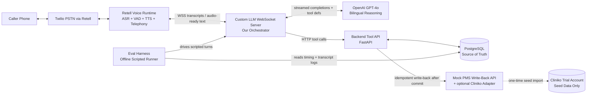
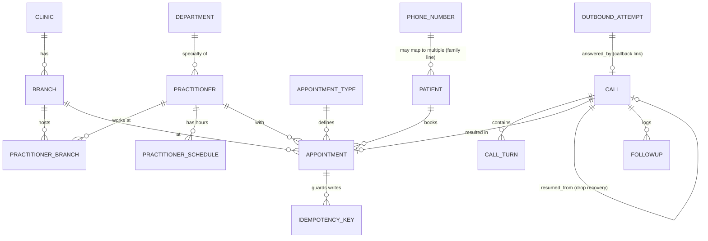
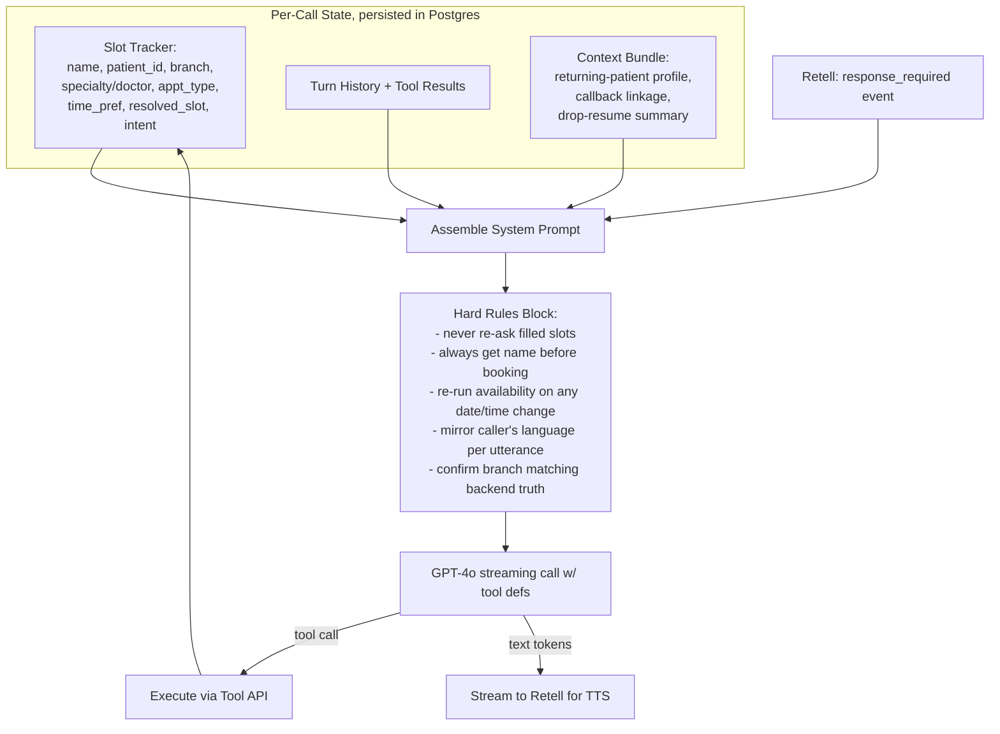
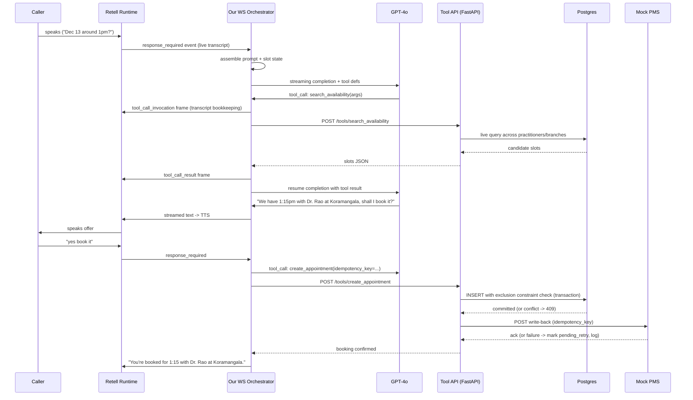
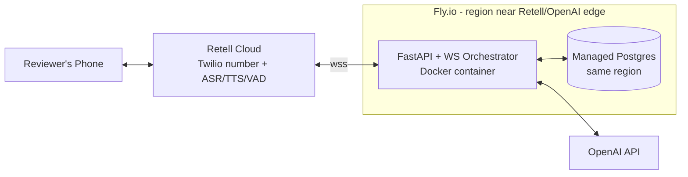

# Care AI — Voice AI Receptionist: Implementation Plan

## 0. Framing

This is scored on real-world robustness, not demo polish: live multilingual calls, real conflict-safe scheduling, per-language eval metrics, and a defensible stack justification. The plan below is designed so every "required scenario" and "test case" in `ASSIGNMENT.md` maps to a specific architectural mechanism — not to prompt-engineering hope.

---

## 1. High-Level Architecture



Key property: **our own Postgres DB is the single source of truth for scheduling**, not Retell's context window and not Cliniko. Retell owns audio (ASR/VAD/TTS/telephony); our WebSocket server owns conversation state and every decision that must never be "forgotten" (already-answered fields, drop recovery, returning-caller identity).

---

## 2. Technology Stack (with reasoning)

| Layer | Choice | Why |
|---|---|---|
| Voice platform | **Retell AI** (Custom LLM mode) | Assignment forces Retell-or-Bolna. Retell wins here on: (1) managed telephony (Twilio-backed number provisioning, no SIP/carrier ops to build in 3 days), (2) native VAD-based barge-in/interruption handling out of the box, (3) documented Custom LLM WebSocket contract (`response_id`, `content`, `content_complete`, `tool_call_invocation`/`tool_call_result`, `interaction_type`) that lets us fully own conversation state while Retell owns audio, (4) 31+ languages including Hindi with per-utterance auto language detection, satisfying "no translation dictionary." Bolna is cheaper (~$0.03/min vs ~$0.10/min) and self-hostable with more pipeline control, but for a 3-day deadline the ops cost of self-hosting the STT/TTS/telephony stack isn't worth it, and Retell's managed VAD/barge-in reduces the highest-risk item in the constraints ("interruption handling is good"). This trade-off, with real numbers, goes in the README per the assignment's explicit ask. |
| Underlying LLM | **OpenAI GPT-4o** (via our WebSocket server, not Retell's built-in LLM) | Strong native Hindi/English bilingual generation without translation shims, reliable streaming function-calling, low time-to-first-token. Using *our own* LLM call (Custom LLM mode) instead of Retell's hosted "Retell LLM" is the core decision that makes the hard scenarios (no redundant questions, stale-availability re-check, drop resume) deterministic rather than prompt-hope: we control exactly what goes into the prompt every single turn. |
| Backend framework | **Python + FastAPI** (async) | Needs to run two different async workloads well: (a) the Retell WebSocket loop (low-latency streaming), (b) the eval harness (scripted conversation simulation + timing instrumentation). Pydantic gives us strict, self-documenting tool-call schemas — directly satisfies "a clean, well-scoped tool-calling schema." |
| Database | **PostgreSQL** | Only real relational DB gives us a **DB-level exclusion constraint** (`EXCLUDE USING gist` on practitioner + time range) — this is how "conflict/double-booking checks enforced at write time" is satisfied *at the database layer*, not just in application code, so it holds under real concurrency, not just in a demo. |
| ORM/migrations | **SQLAlchemy 2.0 (async) + Alembic** | Explicit schema control needed to define the exclusion constraint and buffer-time logic; migrations give reviewers a readable history of schema decisions. |
| Session/state persistence | **Postgres only (no Redis/queue)** | Assignment explicitly requires "re-runnable from a clean clone." Every extra infra dependency is a way for a reviewer's clean clone to fail. Call state, transcripts, and idempotency keys all live in Postgres tables — durable (needed anyway for drop-resume) and zero extra moving parts. |
| PMS integration | **Adapter interface**: `MockPMSAdapter` (default, always on) + optional `ClinikoPMSAdapter` | Assignment literally asks for a "mock EHR/PMS write-back API (yours to build)" *and* says "Use Cliniko PMS for clinic creation." These are reconciled by using Cliniko once, during setup, to source a real clinic's doctors/branches/hours (satisfies "real doctors... sourced not invented"), while runtime write-back hits our own mock PMS service so the live demo doesn't depend on a 30-day trial account still being alive when reviewers test it weeks later. |
| Hosting | **Fly.io** (backend, WebSocket-friendly, region-pinnable) + **Neon/Fly Postgres** (same region) | WebSocket support and region pinning matter directly for latency — colocating our Custom LLM server with the OpenAI API region and near Retell's edge minimizes the extra network hop the Custom LLM pattern introduces. |
| ASR | Retell-managed (Deepgram multilingual under the hood) | No separate integration needed; auto language detection per utterance is required for real code-switching (not a lookup table). |
| TTS | Retell-managed, **ElevenLabs multilingual voice** | Realistic, low-latency streaming TTS with reasonable code-switch prosody; configurable per agent without extra infra. |

---

## 3. Database Schema



Core tables (representative columns, not exhaustive):

- **clinics**(id, name, default_timezone, default_currency)
- **branches**(id, clinic_id, name, address, timezone, phone)
- **departments**(id, clinic_id, name) — e.g. Dental, Physiotherapy
- **practitioners**(id, clinic_id, department_id, display_name, title)
- **practitioner_branches**(practitioner_id, branch_id) — supports multi-branch doctors
- **practitioner_schedules**(practitioner_id, branch_id, weekday, start_time, end_time, valid_from, valid_to) + **schedule_exceptions**(practitioner_id, date, is_blocked, reason) for leave/holidays
- **appointment_types**(id, department_id, name, duration_minutes, buffer_minutes, price, currency, cancellation_fee, fee_window_hours)
- **patients**(id, full_name, phone, date_of_birth, notes, created_at) — phone is **not** unique (family-line sharing is explicit requirement); disambiguation happens by name
- **phone_patient_link**(phone, patient_id) — supports "two patients, one phone number"
- **appointments**(id, patient_id, practitioner_id, branch_id, appointment_type_id, start_time, end_time, status[booked/rescheduled/cancelled], pms_sync_status[pending/synced/failed], created_by_call_id, `EXCLUDE USING gist (practitioner_id WITH =, tsrange(start_time,end_time) WITH &&) WHERE status='booked'`)
- **calls**(id, retell_call_id, phone, direction[inbound/outbound], status, disconnected_at, resumed_from_call_id, linked_outbound_attempt_id, detected_language_mix)
- **call_turns**(id, call_id, turn_index, role, language_detected, text, tool_called, tool_latency_ms, asr_latency_ms, llm_ttft_ms, tts_first_byte_ms, timestamp) — feeds the eval harness latency breakdown directly
- **outbound_attempts**(id, patient_id, phone, reason, status[unanswered/answered], context_snapshot_json, created_at) — powers the "missed outbound call, callback" scenario
- **followups**(id, call_id, patient_id, category[human_requested/clinical_concern/other], notes, status[open/resolved])
- **idempotency_keys**(key, operation_type, appointment_id, request_hash, response_snapshot, created_at) — used both for our own booking API and for PMS write-back retries

The exclusion constraint is the concrete, DB-enforced answer to "conflict/double-booking checks enforced at write time." Buffer time is enforced by computing candidate slot ranges as `[start - buffer, end + buffer)` when checking for overlap, not by shrinking the appointment itself.

---

## 4. Backend API Design

Two clearly separated surfaces, matching "a clean, well-scoped tool-calling schema between agent and backend":

### 4.1 Tool-calling API (called by our LLM orchestrator during live calls)

| Endpoint | Purpose | Notes |
|---|---|---|
| `POST /tools/get_call_context` | Called at call start | Looks up phone -> patients (0/1/many), open outbound_attempts (callback detection), most recent disconnected call within a short window (drop-resume detection), prior appointment context |
| `POST /tools/lookup_patient` | Disambiguate by name when phone maps to >1 patient | Never assumes; returns candidates, requires name match |
| `POST /tools/search_availability` | Resolve natural time references to concrete slots | Always hits live DB — **no caching layer exists**, by design, so "stale availability from memory" cannot happen at the data layer; searches across all practitioners/branches matching criteria, returns earliest-first |
| `POST /tools/create_appointment` | Confirm booking | Requires `caller_full_name` (booking API rejects if absent — enforces "never book anonymously" at the schema level, not just prompt instruction); DB exclusion constraint is the real conflict guard; idempotency_key required |
| `POST /tools/reschedule_appointment` | Change existing booking | Re-runs `search_availability`-equivalent live check before committing; computes fee applicability from `fee_window_hours` vs. time-to-appointment, only surfaces fee if inside window |
| `POST /tools/cancel_appointment` | Cancel | Same fee-window logic |
| `POST /tools/log_followup` | Escalation / human-handoff / clinical concern | Never claims a live transfer; just logs + sets caller expectation |

Every mutating endpoint requires an `Idempotency-Key`; on retry with the same key, we return the previously stored result instead of re-executing — this is what makes "tool call retried after a flaky network blip" safe, and is a direct requirement in "idempotency, and a defined behavior when that call fails" for the PMS layer as well.

### 4.2 Webhook / lifecycle endpoints

| Endpoint | Purpose |
|---|---|
| `POST /webhooks/retell/call-ended` | Finalize call_turns, flag `pms_sync_status=pending_retry` items, trigger reconciliation |
| `POST /admin/outbound/trigger` | Initiates a Retell outbound call (used for reminder/reschedule-confirmation scenarios that later produce a "callback" test) |
| `GET /admin/reconcile-pms` | Manually/cron-triggered retry of failed PMS write-backs with backoff |

### 4.3 The conversation brain

`WSS /llm-websocket/{call_id}` — implements Retell's Custom LLM protocol directly:
- Sends `response_id: 0` immediately (required or Retell stays silent)
- On each `response_required` event: reloads server-side call state, assembles system prompt with an explicit "already known this call" block, streams GPT-4o output back turn-by-turn, emits `tool_call_invocation`/`tool_call_result` frames when the model calls a tool
- Responds to `ping_pong` within 1s to avoid call teardown
- On tool call requiring >300ms (availability search, booking write), emits a short natural holding phrase chunk first ("ek second, check karti hoon...") before the tool result returns — this is the concrete mechanism behind "latency should be masked with a natural holding phrase," not just an instruction to the LLM.

---

## 5. Voice Agent Architecture



Design principles directly answering the assignment's hard scenarios:

- **No redundant questions**: the slot tracker is server-side ground truth, not LLM memory. Every prompt assembly explicitly lists filled slots and instructs the model they are forbidden topics. This is testable/verifiable in the eval harness (a redundant-question detector), not just "hoped for."
- **Stale availability**: `search_availability` is never cached and is re-invoked automatically whenever `time_pref` or `branch`/`practitioner` changes in the slot tracker — enforced by orchestrator logic, not left to model discretion.
- **Returning patient / callback / drop-resume**: all resolved in `get_call_context` at call start, before the first LLM turn, and injected into the context bundle — the model never has to "decide" to remember, the state is handed to it.
- **Language handling**: no translation dictionary anywhere in the codebase. GPT-4o generates natively in whatever language(s) the turn needs; the only prompt instruction is "mirror the caller's language choice per utterance; do not switch language absent a cue." Verified empirically via the eval harness's per-language + code-switch test cases, not assumed correct.
- **Interruption handling**: delegated to Retell's VAD/barge-in; our responsibility is keeping TTS chunks short and idempotent-safe (a tool call interrupted mid-flight must not double-execute — covered by idempotency keys).

---

## 6. Tool-Calling Flow (Retell <-> Backend <-> DB <-> PMS)



Failure behavior when PMS write-back fails: the appointment is **already committed** in our DB (source of truth) before the PMS call happens, so the caller's booking is never silently lost. We mark `pms_sync_status=pending_retry`, log it, and a background job (`GET /admin/reconcile-pms`, cron-triggered) retries with exponential backoff. This is the explicit "defined behavior when that call fails" the assignment asks for.

---

## 7. Folder Structure

```
care-ai/
  backend/
    app/
      api/                  # FastAPI routers: tools/, webhooks/, admin/
      llm/                  # Retell WS handler, prompt templates, slot tracker
      domain/                # scheduling logic, conflict resolution, fee/buffer policy
      adapters/
        pms/                 # PMSAdapter interface, MockPMSAdapter, ClinikoPMSAdapter
        retell/              # thin Retell REST client (agent config, outbound calls)
      db/
        models/              # SQLAlchemy models
        migrations/           # Alembic
        session.py
      core/                  # config, logging, timezone helpers
      main.py
    tests/                   # unit + concurrency test for exclusion constraint
    pyproject.toml
  eval/
    scenarios/                # scripted multi-turn conversations, per scenario, per language
    harness/                  # simulator + metrics computation
    reports/
    run_eval.py
  seed/
    seed_clinic.py            # one-time import of real sourced clinic data (+ optional Cliniko pull)
  infra/
    docker-compose.yml        # postgres + backend, for "clean clone" local run
    Dockerfile
    fly.toml
  docs/
    architecture.md
    prompts/                  # submitted "prompt and prompt logic" artifact
  README.md
```

---

## 8. Deployment Architecture



- Backend containerized, deployed to Fly.io (WebSocket-friendly, region pinning to minimize the Custom-LLM extra hop).
- Retell dashboard points the provisioned phone number's agent config at our `wss://.../llm-websocket/{call_id}` and webhook URLs.
- Secrets (OpenAI key, Retell API key, DB URL, optional Cliniko key) via env vars, `.env.example` committed, real `.env` never committed.
- Structured logging correlated by `call_id`, with per-turn timing columns in `call_turns` feeding the eval harness's latency breakdown directly from production/live-test calls, not just synthetic runs.

---

## 9. Milestone Plan

| Milestone | Scope | Deliverable at end |
|---|---|---|
| M0 | Repo scaffold, Postgres schema + Alembic migrations, docker-compose, seed script with a real sourced clinic (2 branches, doctors, departments, hours) | `docker compose up` gives a running backend with populated DB, verifiable via `/docs` and curl |
| M1 | Tool-calling API complete against real DB; exclusion constraint proven via concurrency test (two simultaneous bookings on same slot -> one fails); MockPMSAdapter with idempotency + simulated failure/retry | Passing test suite demonstrating DB-enforced double-booking prevention and idempotent write-back |
| M2 | Retell phone number provisioned; Custom LLM WebSocket wired to a minimal English-only prompt that can search and book | Live callable number, English happy-path booking end to end against real backend/DB |
| M3 | Hindi + code-switching; natural-language time-reference resolution for the 4 example utterances; holding-phrase latency masking | Same number now handles Hindi and mixed-language booking correctly |
| M4 | Hard scenarios: returning patient, missed-call callback, drop-resume, stale-availability re-check, earliest-slot cross-branch search, branch-specific triage, shared-phone disambiguation, fee-window logic, buffer-time enforcement, escalation logging | Each scenario has a passing scripted eval case and is demonstrable live |
| M5 | Eval harness complete: scripted multi-turn conversations per scenario per language, latency-by-component metrics, turns-to-completion + redundant-question rate, re-runnable report | `python eval/run_eval.py` produces a report from a clean clone |
| M6 | Deployment hardening, README (stack justification, latency numbers, known limitations), prompt docs, final live-number verification | Submission-ready: GitHub repo, live number, README, prompt logic doc |

---

## 10. Assumptions and Ambiguities

1. **Platform**: Retell chosen over Bolna; documented trade-off (managed polish + built-in VAD vs. Bolna's lower cost/more control) goes in the README as required. Revisit if there's an existing Bolna investment.
2. **Custom LLM vs. Retell-hosted LLM**: chose Custom LLM (WebSocket) over Retell's built-in LLM + Custom Functions mode specifically because the hard scenarios need deterministic server-side state control. This adds one network hop, mitigated by colocating the backend near Retell/OpenAI's region.
3. **Cliniko's role**: used once, at setup, to source a real clinic's doctors/branches/hours (satisfies "sourced not invented"). Runtime scheduling and conflict-checking happen in our own Postgres DB, and write-back hits our own mock PMS — this keeps the live system independent of a 30-day trial account's continued existence when reviewers test it. `PMSAdapter` is an interface so a live `ClinikoPMSAdapter` can be swapped in if desired.
4. **Which real clinic**: not yet finalized — will source a real, publicly documented multi-branch clinic (likely India-based, matching the Bangalore hiring context and easiest to verify accuracy) during M0, and document the source. Currency/timezone will follow that clinic's actual locale.
5. **"Missed outbound call, callback"**: assumes our own system is the one placing the outbound call (e.g., a reschedule-confirmation call), via Retell's outbound calling API — not a full outbound campaign system, just enough to make the scenario real and testable.
6. **No Redis/queue**: intentionally omitted for infra-minimalism given the "re-runnable from a clean clone" requirement; can be added later if scale requires it.
7. **No SMS/WhatsApp confirmation**: out of scope unless requested; voice confirmation only, per the assignment text.
8. **Buffer time / cancellation fee window values**: not specified in the assignment; will be seeded from the real clinic's actual published policy if available, otherwise reasonable defaults (documented explicitly in the README, not hidden).
9. **Escalation/human handoff**: no real live transfer is built (would require a real staffed line); we log a followup and set the expectation that someone will call back, per the explicit instruction not to imply an immediate transfer that isn't happening.
10. **Timezone correctness**: each branch stores an explicit IANA timezone; all "today/tomorrow" resolution happens server-side in that timezone, never UTC-naive — directly targets the assignment's called-out "UTC bug shifts today to tomorrow" failure mode.
